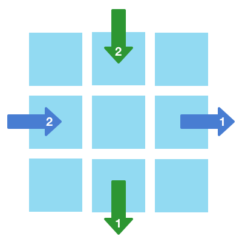
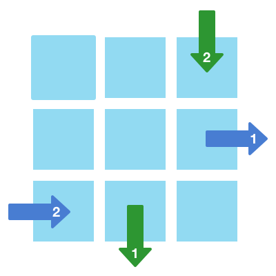
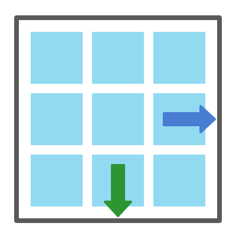

# react-arrow-navigation

> A react library for managing navigation with arrow keys

## Install

```bash
npm install --save react-arrow-navigation
```

## Usage

Mount `ArrowNavigation` in your app, and register components that receive navigation state with the `useArrowNavigation` hook. It takes two arguments: an x and y navigation index.

```jsx
import React from 'react'
import { ArrowNavigation, useArrowNavigation } from 'react-arrow-navigation'

const NavigationChild = ({ xIndex, yIndex }) => {
    const { selected, active } = useArrowNavigation(xIndex, yIndex)
    return (
        <div className={selected && active ? 'child selected' : 'child'}>
            {`Index [${xIndex}, ${yIndex}]`}
        </div>
    )
}

const MyApp = () => (
    <ArrowNavigation className="nav">
        <NavigationChild xIndex={0} yIndex={0} />
        <NavigationChild xIndex={0} yIndex={1} />
        <NavigationChild xIndex={0} yIndex={2} />
    </ArrowNavigation>
)
```
[Live example here](https://codesandbox.io/embed/upbeat-water-6fjck)

`useArrowNavigation` returns two values that represent the navigation state:
- `selected`: whether this index is currently selected
- `active`: whether this `ArrowNavigation` component is currently focused

This gives you flexibilty when implementing navigable components. For example:
- A button group: you might want the button to stay in a selected state even when the button group is not focused
- A drop down menu: the menu items would only need to be in a selected state when the dropdown is focused/open


### The `select` callback

You may also want to be able to update the navigation state when a component is clicked. For example:

1. A user navigates through a button group with the arrow keys
2. Then they click on a button in the group
3. Then they continue navigating with the arrow keys

When this happens you want the navigation index to be updated on click, so when they use the arrow keys again the index is correct.

To achieve this we can use the `select` callback provided by `useArrowNavigation`:

```jsx
const ButtonGroupButton = ({ xIndex }) => {
    const { selected, select } = useArrowNavigation(xIndex, 0)
    return (
        <div
            className={selected ? 'bg-button selected' : 'bg-button'}
            onClick={() => {
                // Click handler logic goes here
                select() // Then call the `select` callback
            }}
        >
            {`Option ${xIndex + 1}`}
        </div>
    )
}
```
[Live example here](https://codesandbox.io/embed/nostalgic-voice-71d2k)


### `ArrowNavigation` focus state

To toggle the `active` state, `ArrowNavigation` returns a containing `<div>`, and listens to the `onFocus`, and `onBlur` events. It updates `active` to be `true` when the `<div>` is focused, and `false` when it is not. It also switches `active` to `false` when the Escape key is pressed.

Additional props passed to `ArrowNavigation` are spread on to the `<div>`. This includes support for a `ref` prop, implemented with [React.forwardRef](https://reactjs.org/docs/react-api.html#reactforwardref).

If you want to opt-out and manage the `active` state yourself, use [`BaseArrowNavigation`](#BaseArrowNavigation). Its `active` state is determined by its `active` prop. It does not insert a containing `<div>`.


### Managing the focus state of navigable components

Sometimes you will want navigable components to be focused when they are selected. There are behaviors built into browsers you might want to leverage (`onClick` being fired when the user hits the Enter key), and it's also good for acessibility: screen readers rely on the focus state.

To enable this there is a hook: `useArrowNavigationWithFocusState`.  It returns an additional value: `focusProps`, which is spread onto the navigable component. `focusProps` is comprised of `tabIndex`, `onClick`, and `ref`. In more complex cases you may want to access these props directly: e.g. you need to do something else in the click handler.

Here is a dropdown menu implemented with it:

```jsx
import React, { useState, useRef, useEffect } from 'react'
import { ArrowNavigation, useArrowNavigationWithFocusState } from 'react-arrow-navigation'

const DropdownMenuItem = ({ index, label, closeMenu }) => {
    const {
        focusProps: { ref, tabIndex, onClick },
    } = useArrowNavigationWithFocusState(0, index)

    return (
        <button
            className="menu-item"
            ref={ref}
            tabIndex={tabIndex}
            onClick={() => {
                onClick()
                alert(`Clicked: "${label}"`)
                closeMenu()
            }}
        >
            {label}
        </button>
    )
}

const DropdownMenu = ({ label, itemLabels }) => {
    const [open, setOpen] = useState(false)
    const navRef = useRef()

    useEffect(() => {
        if (open) {
            navRef.current && navRef.current.focus()
        }
    }, [open])

    return (
        <div>
            <button
                className="dropdown-button"
                onClick={() => {
                    setOpen(!open)
                    navRef.current && navRef.current.focus()
                }}
            >
                {open ? 'Close the menu' : 'Open the menu'}
            </button>
            {open && (
                <ArrowNavigation className="menu" ref={navRef} initialIndex={[0, 0]}>
                    {itemLabels.map((itemLabel, index) => (
                        <DropdownMenuItem
                            index={index}
                            label={itemLabel}
                            closeMenu={() => setOpen(false)}
                            key={index}
                        />
                    ))}
                </ArrowNavigation>
            )}
        </div>
    )
}

const MyApp = () => (
    <DropdownMenu itemLabels={['Navigate through', 'The menu items', 'With arrow keys']} />
)
```
[Live example here](https://codesandbox.io/embed/quizzical-herschel-g974g)

`useArrowNavigationWithFocusState` has to interact with the focus state of `ArrowNavigation`, so it is not compatible with `BaseArrowNavigation`.


### Other things to be aware of

- `useArrowNavigation` retrieves the navigation state from `ArrowNavigation` using the context API, so navigable components can be arbitrarly nested
- The navigation indexes can have holes. For example: if the y index for each navigable component is 0, and the x indexes are 0, 2, 3, and 4, it will navigate from 0 to 2 when you hit the right arrow key. This can be useful when you need to dynamically pull a navigable component from the navigation index, e.g. a menu item that is currently disabled.


## API

### ArrowNavigation

`ArrowNavigation` manages the selection state of the navigation indexes, and its active state based on if it is focused.

Props:
- `children`: `React.Node`
    
- `initialIndex`: `[number, number]` (optional)
  
  An index to be selected when `ArrowNavigation` is first focused
  
- `mode`: `'roundTheWorld' | 'continuous' | 'bounded'` (optional)

  The edge mode of the navigation: what happens when a user goes over the edges of the x and y indexes. The options are:

  1. `'roundTheWorld'` (this is the default)

     

  2. `'continuous'`

     

  3. `'bounded'`

     
     
- `reInitOnDeactivate`: `true | false` (optional)

  Resets the indexes when `ArrowNavigation` deactivates

- `...divProps`

  All other props passed to `ArrowNavigation` are passed onto the `div` it returns. This includes support for the `ref` prop.


### useArrowNavigation(x: number, y: number)

The `useArrowNavigation` hook takes two arguments: an x and y navigation index.

Returned values:
- `selected`: `true | false`

  Whether this index is currently selected

- `active`: `true | false`

  Whether the navigation component (`ArrowNavigation` or `BaseArrowNavigation`) is active. Active means it is responding to keypresses.

- `select`: `() => void`

  A callback that updates the selected index to this one


### useArrowNavigationWithFocusState(x: number, y: number)

The `useArrowNavigation` hook takes two arguments: an x and y navigation index. It is not compatible with `BaseArrowNavigation`.

Returned values:
- `selected`, `active`, and `select` are the same as for [`useArrowNavigation`](#useArrowNavigation)

- `focusProps`: `{ ref, tabIndex, onClick }`

  `focusProps` should be spread onto the navigable component. They will:

  - Set the `tabIndex` to `0` if it is selected and `-1` otherwise
  - Focus the component when its index is selected, _and_ `active` is `true`
  - Set the selected index to this one on click
  
  In complex cases you may want to access these props directly, e.g. if you need to do another thing in the component's click handler:
  
  ```jsx
      onClick={() => {
          // Click handler logic goes here
          onClick() // Then call the onClick callback from `focusProps`
      }}
   ```


### BaseArrowNavigation

`BaseArrowNavigation` works in a similar way to `ArrowNavigation`, except it does not return a containing div, and
does not manage it's active state. This is now passed in with a prop.

Props:
- `children`, `initialIndex`, `mode`, and `reInitOnDeactivate` are the same as for [`ArrowNavigation`](#ArrowNavigation)

- `active`: `true | false`

  Whether the component should update the selected index in response to keypresses


## License

MIT © [Jack Aldridge](https://github.com/jackaldridge)
